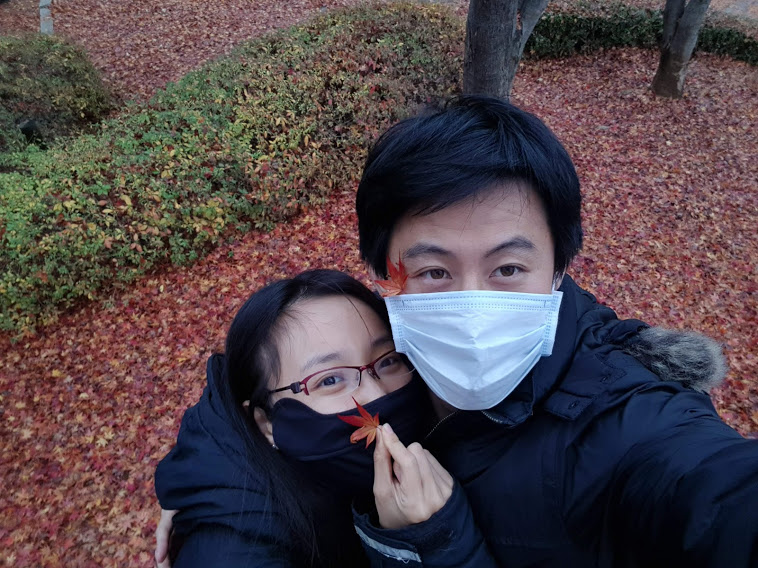

<!-- Packages -->
```{r setup, include=FALSE}
knitr::opts_chunk$set(echo = F,warning=FALSE, message=FALSE)
```

# 초대합니다 (Invitation) {#index}

{width=900}

한 가정의 가장이 되기에는 많이 부족하고 부끄럽지만 하나님이 이루신 가정임을 신뢰하며 새로운 가정을 이루고자 합니다. 바쁘시지만 시간이 되시면 오셔서 축복해 주세요. 

> *We would like to invite you to the wedding as we are going to start a new family in God with faith that God has joined us together. I still feel I am not enough to lead the house but have a faith that God will lead the house not me. We are looking forward to your gracious presence.* 

{width=900}

# 사진보기 (Pictures)

{width=200} {width=200}{width=200}

{width=300} {width=300}

{width=300} {width=300} 

{width=200} {width=200}{width=200}

{width=300} {width=300} 

{width=300} {width=300} 


{width=200} {width=200} {width=200} 


# 장소 (Location)


 
 <div align="center">

<style type="text/css">
td{padding:0 15px 0 15px;}
</style>


```{r echo = F,warning=FALSE, message=FALSE}
library(leaflet)

leaflet() %>%
  addTiles() %>%  # Add default OpenStreetMap map tiles
  addMarkers(lng=126.78045, lat=37.64956, popup="The Wedding place") %>% 
  addMiniMap()

```


[플로렌스 일산 (Florence)](http://fph.co.kr/web/home.php?go=Amenu_01&item_num=35)

 
경기도 고양시 일산동구 중앙로 1130 일산올리브상가 3층 

(806 Madu-dong, Ilsandong-gu, Goyang-si, Gyeonggi-do)
</div> 

