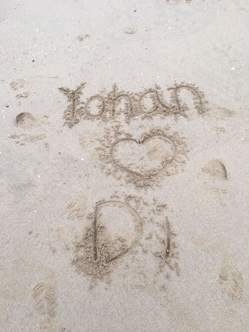

<!-- Packages -->
```{r setup, include=FALSE}
knitr::opts_chunk$set(echo = F,warning=FALSE, message=FALSE)
```

# 초대합니다 (Invitation) {#index}

{width=900}

한 가정의 가장이 되기에는 많이 부족하고 부끄럽지만 하나님이 이루신 가정임을 신뢰하며 새로운 가정을 이루고자 합니다. 바쁘시지만 시간이 되시면 오셔서 축복해 주세요. 

> *We would like to invite you to the wedding as we are going to start a new family in God with faith that God has joined us together. I still feel I am not enough to lead the house but have a faith that God will lead the house not me. We are looking forward to your gracious presence.* 

{width=900}

# 사진보기 (Pictures)

{width=743} 

{width=743} 

{width=317} {width=423}

{width=370} {width=370} 

{width=370} {width=370} 

{width=370} {width=370}


{width=370} {width=370}

{width=370} {width=370}

{width=370} {width=370} 

{width=370} {width=370} 

{width=370} {width=370}

{width=350} {width=390} 

{width=370} {width=370} 

{width=368} {width=373}

{width=744}

# 이야기 (Story)

세상을 동경했습니다. 세계 45개국을 다니며 산으로, 바다로, 북극으로, 사막으로, 그리고 우상들..세상을 메칠 수 있다고 생각했지만 결혼을 통해 저의 한계와 절망을 깨닫습니다. 오직 하나님께 갇힌자가 되어 메치기를 잘 당하겠습니다. 많이 찌그러지고 있지만 제가 아닌 하나님께서 하심을 신뢰하며 계속해서 함께 나가겠습니다. 

>이것을 너희에게 이름은 너희로 내 안에서 평안을 누리게 하려함이라 세상에서는 너희가 환난을 당하나 담대하라 내가 세상을 이기었노라 하시니라 - 요한복음 16:33 (I have tod you all this so that you may have peace in me. Here on earth you will have many trials and sorrows. But take heart, because I have overcomethe world - John 16:33)


<iframe width="360" height="315" src="https://www.youtube.com/embed/2-OqPaVijwU" title="YouTube video player" frameborder="0" allow="accelerometer; autoplay; clipboard-write; encrypted-media; gyroscope; picture-in-picture" allowfullscreen></iframe>


# 장소 (Location)

**오시는 길**

대중교통으로 오시는 경우, 마두역 8번 출구에서 백석역 방향으로 내려오시면 이마트 사거리, 이마트 맞은 편에 위치해 있습니다. 자차로 오시는 경우, 아래 주소를 참고해서 오세요. 주차 가능해요.  
 
 <div align="center">

<style type="text/css">
td{padding:0 15px 0 15px;}
</style>


```{r echo = F,warning=FALSE, message=FALSE}
library(leaflet)

leaflet() %>%
  addTiles() %>%  # Add default OpenStreetMap map tiles
  addMarkers(lng=126.78045, lat=37.64956, popup="The Wedding place") %>% 
  addMiniMap()

```


[플로렌스 일산 (Florence)](http://fph.co.kr/web/home.php?go=Amenu_01&item_num=35)

 
경기도 고양시 일산동구 중앙로 1130 일산올리브상가 3층 

(806 Madu-dong, Ilsandong-gu, Goyang-si, Gyeonggi-do)
</div> 

